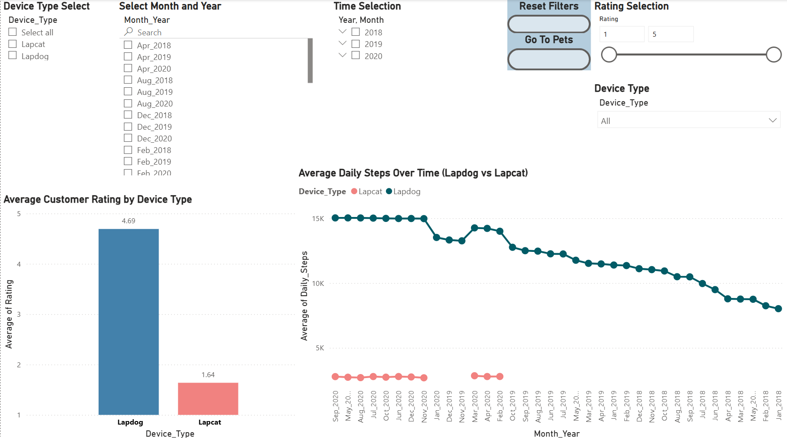
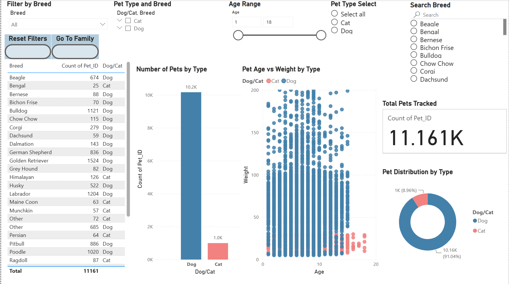
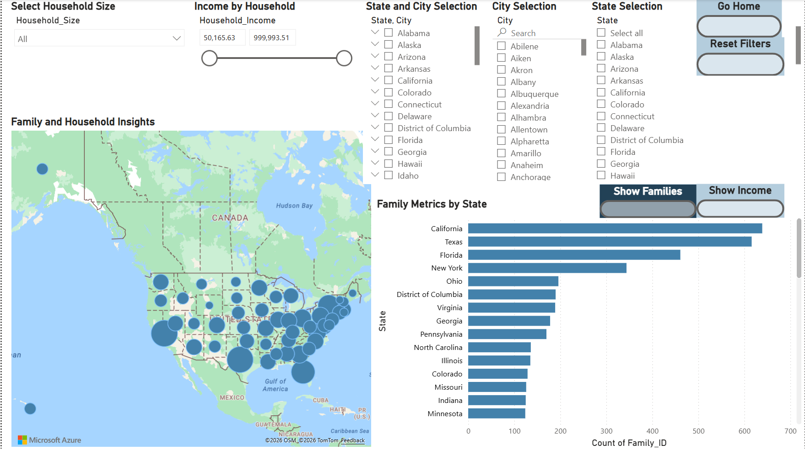

# Power BI Waggle Dashboard

## Overview

This project showcases an interactive Power BI dashboard built to analyze customer, pet, and household data using a variety of visualizations, slicers, and DAX measures. The dashboard allows users to explore trends through dynamic filtering and provides insights into customer ratings, pet demographics, and household characteristics.

---

## Features

- Interactive multi-page dashboard
- Dynamic slicers and filters
- KPI cards
- Bar charts
- Line charts
- Scatter plots
- Donut charts
- Geographic map visualization
- Drill-through navigation
- Custom navigation buttons
- Reset filter buttons
- DAX calculations

---

## Dashboard Pages

### Home Dashboard
- Customer ratings by device type
- Daily steps over time
- Device comparison
- Interactive filtering

### Pets Dashboard
- Pet type and breed analysis
- Age vs. weight visualization
- Pet distribution
- Breed filtering
- Interactive KPI cards

### Family Dashboard
- Household income analysis
- Family distribution by state
- Geographic mapping
- Household size filtering
- Income exploration

---

## Skills Demonstrated

- Power BI Desktop
- Data Visualization
- Dashboard Design
- Business Intelligence
- Data Analysis
- DAX
- Interactive Reports
- Data Modeling
- User Interface Design

---

## Project Structure

```
PowerBI-Waggle-Dashboard/
│
├── Waggle_Dashboard.pbix
├── README.md
└── images/
    ├── home_dashboard.png
    ├── pets_dashboard.png
    └── family_dashboard.png
```

---

## Screenshots

### Home Dashboard



### Pets Dashboard



### Family Dashboard



---

## Dataset

This dashboard was created using a dataset provided as part of a WGU/Udacity learning project. The original dataset is not included in this repository.

---

## Author

**Joshua Reisinger**

GitHub:
https://github.com/joshreisinger17-Data